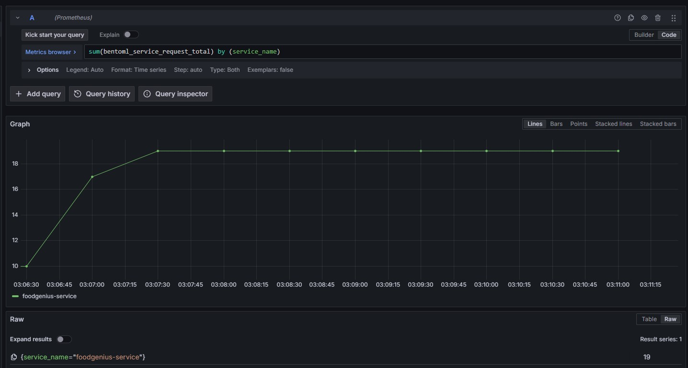

<div align="center">
    <h1 align="center">Food Genius AI</h1>
    <br>
    <strong>Uma aplicação de IA construída usando EfficientNetB2 que pode detectar o tipo de alimento em uma imagem e determinar se a imagem contém alimento ou não.<br></strong>
    <i>Desenvolvido com BentoML 🍱 e PyTorch 🔥</i>
    <br>
</div>
<br>

<div align="center">
    <a href="README.md">🇺🇸 English</a> | <a href="README.pt-br.md">🇧🇷 Português (Brasil)</a>
</div>
<br>

## 📖 Introdução 📖
FoodGeniusAI é uma aplicação de IA que usa EfficientNetB2 para classificar imagens de alimentos. Ela pode identificar o tipo de alimento e determinar se a imagem contém alimento.

<div align="center">
       
</div>

### ✨ Principais Características

- 🍔 Detecção Instantânea: Distingue automaticamente imagens de alimentos e não-alimentos
- 🔍 101 Categorias: Reconhece uma grande variedade de pratos com 80% de precisão
- ⚡ Processamento Rápido: Otimizado para classificação em tempo real
- 🚀 Pronto para Produção: Implantável com BentoML para serviço escalável
- 📱 Suporte à API REST: Fácil integração com qualquer aplicação

### 📊 Modelos

FoodGeniusAI utiliza dois modelos EfficientNetB2 para classificação de alimentos:

#### 1. Detector de Alimento ou Não-Alimento (Modelo Food5K)
- **Objetivo**: Determina se a imagem contém alimento
- **Desempenho**: 90% de precisão
- **Entrada**: Imagens RGB 224x224
- **Saída**: Classificação binária (alimento/não-alimento)
- **Treinamento**: Dataset Food5K (5.000 imagens)

#### 2. Classificador Food101
- **Objetivo**: Identifica categoria específica do alimento
- **Desempenho**: 80% de precisão
- **Entrada**: Imagens RGB 224x224
- **Saída**: 101 categorias de alimentos
- **Treinamento**: Dataset Food101 (101.000 imagens)

#### Pipeline de Classificação
1. Imagem → Detecção de Alimento/Não-Alimento
2. Se alimento detectado → Classificação da Categoria do Alimento
3. Retorna pontuação de predição para cada categoria

### 🛠️ Tecnologias Principais

- **ML & Treinamento**
  - 🧠 EfficientNetB2: Modelo CNN leve e eficiente para classificação de imagens
  - 🔥 PyTorch: Framework de deep learning para treinamento
  - 📊 Jupyter: Desenvolvimento interativo e experimentação

- **Interface & Serviço**
  - 🎨 Gradio: Interface web interativa para demonstração
  - 🍱 BentoML: Serviço e implantação de modelos ML
  - 🐳 Docker: Containerização para implantações consistentes

- **Infraestrutura**
  - ⚓ Kubernetes: Orquestração de containers em escala
  - 📈 Prometheus & Grafana: Métricas em tempo real e visualização

## Glossário
- [Requisitos](#-requisitos-)
- [Executando o Serviço](#-executando-o-serviço-)
- [Usando o Serviço](#-usando-o-serviço-)
- [Aplicativo no Hugging Face](#-aplicativo-no-hugging-face-)
- [Treinamento e Predição](#-treinamento-e-predição-)
- [Jupyter Notebooks](#-jupyter-notebooks-)
- [Deploy para Kubernetes](#-deploy-para-kubernetes-)
- [Observabilidade](#-observabilidade-)

## 📋 Requisitos 📋

- Python 3.11+
- BentoML
- Pip

## 🏃‍♂️ Executando o Serviço 🏃‍♂️

Clone o repositório:
```bash
git clone https://github.com/daviaraujocc/FoodGeniusAI.git
cd FoodGeniusAI
```
### BentoML CLI

Instale as dependências:
```bash
pip install -r requirements/cpu-requirements.txt
```

Sirva o serviço BentoML:
```bash
bentoml serve 
```

Você pode então abrir seu navegador em http://127.0.0.1:3000 e interagir com o serviço através do Swagger UI.


### Docker (Recomendado)

Para executar o serviço em um container, você pode usar os seguintes comandos:

Para CPU:

```bash
bentoml build -f bentofile.yaml
```

```bash
bentoml containerize foodgenius-service:latest
```

```bash
docker run -p 3000:3000 foodgenius-service:$(bentoml get foodgenius-service:latest | yq -r ".version")
```

Para GPU:

```bash
bentoml build -f bentofile.gpu.yaml
```

```bash
bentoml containerize foodgenius-service-gpu:latest 
```

```bash
docker run --gpus all -p 3000:3000 foodgenius-service-gpu:$(bentoml get foodgenius-service-gpu:latest | yq -r ".version")
```

> Note que para rodar com GPU você precisará ter [nvidia-container-runtime](https://docs.nvidia.com/datacenter/cloud-native/container-toolkit/latest/install-guide.html) configurado.

### API Python

Você também pode usar o serviço como uma API Python:

````bash
bentoml build -f bentofile.yaml
````

então inicie o serviço:
```python
import bentoml

bento = bentoml.get('foodgenius-service:latest')

server = bentoml.HTTPServer(bento, port=3000)
server.start(blocking=True)
```

## 🌐 Usando o Serviço 🌐
Você pode usar o serviço BentoML com requisições HTTP. Aqui estão alguns exemplos:

### cURL
O exemplo a seguir mostra como enviar uma requisição para o serviço para classificar uma imagem via cURL:

```bash
curl -X POST \ 
  'http://0.0.0.0:3000/classify' \   
  -H "Content-Type: multipart/form-data" \  
  -F "img=@examples/images/pizza.jpg"
```

### Cliente BentoML

Para enviar requisições via cliente usando a biblioteca python:

```python
IMG_PATH = "examples/images/pizza.jpg"

if __name__ == "__main__":
    import bentoml

    client = bentoml.SyncHTTPClient("http://localhost:3000")

    print("Predictions for image {}".format(IMG_PATH))
    print(client.classify(img=IMG_PATH))

    client.close()
```

## 🤗 Aplicativo no Hugging Face 🤗

Você também pode experimentar a aplicação FoodGeniusAI no Hugging Face Spaces:

[FoodGeniusAI no Hugging Face](https://huggingface.co/spaces/daviaraujocc/foodgeniusai)


## 🏋️‍♂️ Treinamento e Predição 🏋️‍♂️

Antes de executar os scripts/notebooks, é recomendado criar um novo ambiente:

```bash
conda env create -f environment.yml
conda activate foodgenius
```

### Treinamento

Você pode treinar os modelos usando o script `train.py`. Aqui estão os passos:

1. Treinar o modelo `food_or_nonfood`:
    ```bash
    python train.py \ 
    --model food_or_nonfood \
    --epochs 5 \
    --model_name pretrained_effnetb2_food_or_nonfood.pth \ 
    --split_size 1 \
    --batch_size 32 \ 
    --learning_rate 0.001 \
    --device cuda # ou cpu
    ```

2. Treinar o modelo `food101`:
    ```bash
    python train.py \ 
    --model food101 \ 
    --epochs 10 \ 
    --model_name pretrained_effnetb2_food101.pth \ 
    --split_size 0.2 \ 
    --batch_size 32 \ 
    --learning_rate 0.001 \
    --device cuda # ou cpu
    ```

> Use device `cuda` se você tiver uma GPU compatível disponível.

Os resultados do processo de treinamento incluindo acurácia e perda serão salvos no diretório `results`.

#### Hiperparâmetros de Treinamento

| Parâmetro     | Padrão                                      | Descrição       |
|---------------|--------------------------------------------------|---------------------|
| `epochs`    | `5`                                       | Número de épocas para treinamento       |
| `batch_size` | `32`                                      | Tamanho do lote para treinamento             |
| `split_size` | `0.2`                                     | Tamanho da divisão treino-teste |
| `device`     | `cuda`                                    | Dispositivo para treinamento (`cuda` ou `cpu`) |
| `learning_rate`         | `0.001`                                   | Taxa de aprendizagem          |
| `model_name` | `model.pth` | Nome do arquivo do modelo treinado      |	

#### Estrutura do Diretório de Saída do Modelo

```
results/
│
└── food101/
|   └── model_name
|       ├── model.pth
│       ├── model_results.csv
│       └── model_results.png
└── food_or_nonfood/
|   └── model_name
|       ├── model.pth
│       ├── model_results.csv
│       └── model_results.png
```

## 📓 Jupyter Notebooks 📓

Este repositório inclui vários Jupyter Notebooks que demonstram os processos de treinamento e predição usando EfficientNetB2.

Antes de rodar os notebooks, instale as dependências usando conda ou venv:

```bash
conda env create -f environment.yml
conda activate foodgenius
```

### Notebooks de Treinamento

1. **Classificação de Alimentos ou Não-Alimentos**
    - [effnetb2_training_food_or_nonfood.ipynb](effnetb2_training_food_or_nonfood.ipynb)
    - Treina um modelo no dataset Food5K para classificar imagens como alimentos ou não-alimentos.

2. **Classificação Food101**
    - [effnetb2_training_food101.ipynb](effnetb2_training_food101.ipynb)
    - Treina um modelo no dataset Food101 para classificar imagens em 101 tipos de alimentos.

### Notebook de Predição

1. **EfficientNetB2 Predição**
    - [effnetb2_predict.ipynb](effnetb2_predict.ipynb)
    - Demonstra como usar o modelo EfficientNetB2 treinado para fazer predições em novas imagens.

## 🚀 Deploy para Kubernetes 🚀

Para o deploy do serviço em produção, você pode usar os seguintes comandos:

```bash
bentoml build -f bentofile.yaml
```

```bash
bentoml containerize foodgenius-service:latest --image-tag {seu-usuario-repo}/foodgenius-service:latest
```

```bash
docker push {seu-usuario-repo}/foodgenius-service:latest
```

Edite o arquivo `manifests/deployment.yaml` para incluir sua imagem, depois aplique-o ao seu cluster Kubernetes:
```bash
kubectl apply -f manifests/deployment.yaml
```

## 📊 Observabilidade 📊

BentoML fornece recursos de observabilidade integrados, incluindo métricas do Prometheus. Você pode acessar essas métricas no endpoint `/metrics`.

Para instalar o stack de monitoramento no kubernetes, você pode seguir os seguintes passos:

### Configuração Rápida

```bash
chmod +x scripts/setup_monitoring.sh; ./scripts/setup_monitoring.sh
```
Este script instalará o stack prometheus + grafana no namespace monitoring.

Acesse o dashboard do grafana (usuário/senha padrão é `admin`):

```bash
kubectl port-forward svc/grafana -n monitoring 3000:3000
```



## 📝 Autor
**Davi Araujo (@daviaraujocc)**

## TODOS

- [ ] Automatizar treinamento/deploy com ArgoCD workflows + GitOps